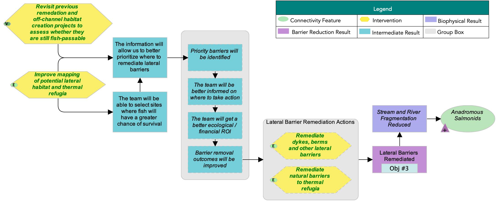
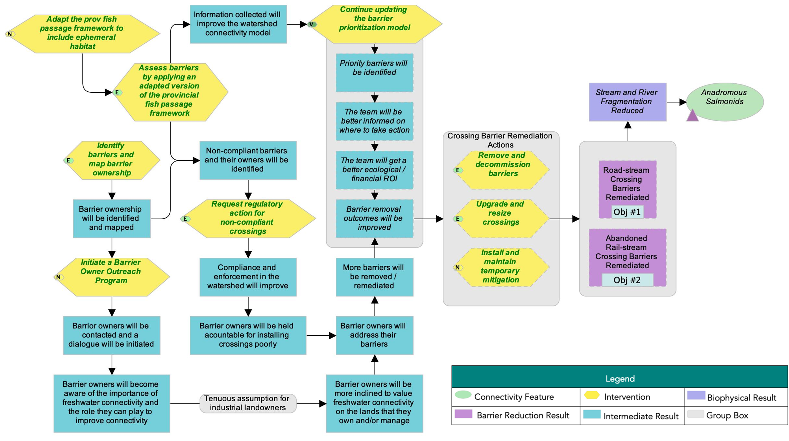
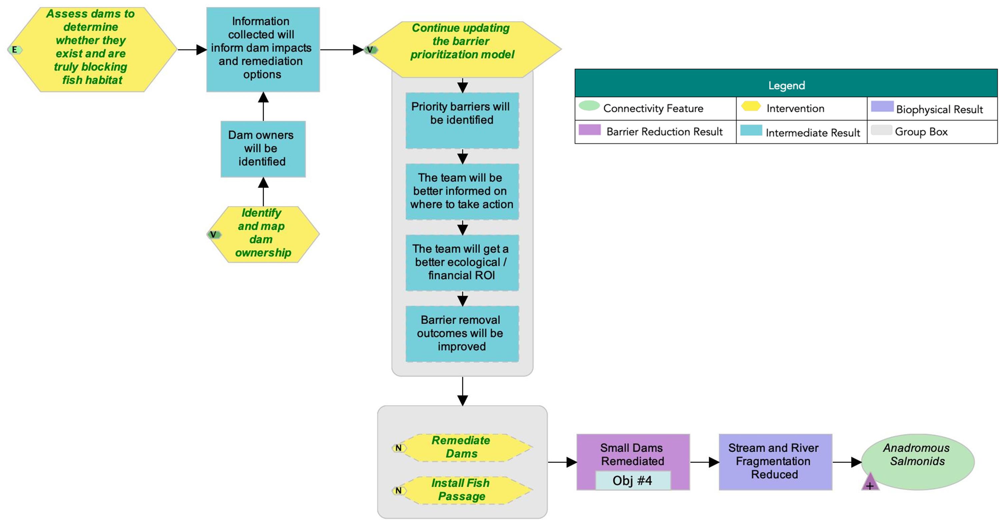
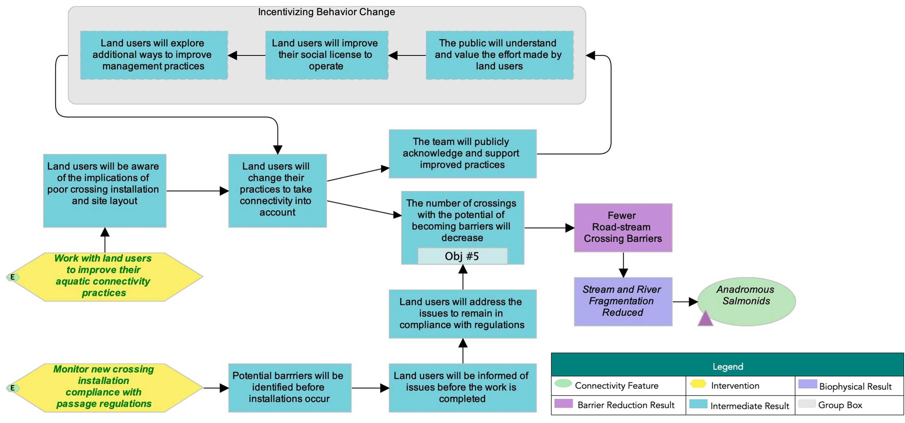

# Appendix C – Situation Analys, Strategies, Actions, and Theories of Change {-}

The following situation model was developed by the WCRP Planning Team to “map” the project context and brainstorm potential actions for implementation. Green text is used to identify actions that were selected for implementation (see Strategies & Actions), and red text is used to identify actions that the project team has decided to exclude from the current iteration of the plan, as they were either outside of the project scope, or were deemed to be ineffective by the Planning Team. 

{fig-cap-location="top"}

## Strategies and Actions {-}

The Planning Team identified five broad strategies to implement through this WCRP: 1) crossing rehabilitation, 2) lateral barrier rehabilitation, 3) dam rehabilitation, 4) barrier prevention, and 5) communication and education. Individual actions were qualitatively evaluated based on the anticipated effect each action will have on realizing on-the-ground gains in connectivity. Effectiveness ratings are based on a combination of “Feasibility” and ”Impact”.  Feasibility is defined as the degree to which the project team can implement the action within realistic constraints (financial, time, ethical, etc.), and Impact is the degree to which the action is likely to contribute to achieving one or more of the goals established in this plan. 

### Strategy 1: Lateral Barrier Rehabilitation  {-}
```{r  echo = FALSE, results = 'asis'}
#| label: table-15
#| tbl-cap: "Table 15. Strategy 1: Lateral barrier rehabilitation (priority on reconnecting thermal refugia)."
#| warning: false
#| echo: false

source("Rscripts/table_formatting.R")
library("flextable")

data <- read.csv("data/table15.csv", check.names=FALSE)
ft <- flextable(data)
ft <- bg(ft, j = c("Feasibility", "Impact"),
         bg = function(x) ifelse(
           x == "Very high", "#008000",
           ifelse(
             x == "High", "#92d050",
             ifelse(x == "Medium", "#ffff00", "white")
           )
         ),
         part = "body")
ft <- bg(ft, j = "Effectiveness",
         bg = function(x) ifelse(
           x == "Very effective", "#008000",
           ifelse(
             x == "Effective", "#92d050",
             ifelse(x == "Need more information", "#ffff00", "white")
           )
         ),
         part = "body")
ft <- format_flextable(ft)
ft
```

### Strategy 2: Crossing Rehabilitation  {-}
```{r  echo = FALSE, results = 'asis'}
#| label: table-16
#| tbl-cap: "Table 16. Strategy 2: Crossing rehabilitation."
#| warning: false
#| echo: false

source("Rscripts/table_formatting.R")
library("flextable")

data <- read.csv("data/table16.csv", check.names=FALSE)
ft <- flextable(data)
ft <- bg(ft, j = c("Feasibility", "Impact"),
         bg = function(x) ifelse(
           x == "Very high", "#008000",
           ifelse(
             x == "High", "#92d050",
             ifelse(x == "Medium", "#ffff00", "white")
           )
         ),
         part = "body")
ft <- bg(ft, j = "Effectiveness",
         bg = function(x) ifelse(
           x == "Very effective", "#008000",
           ifelse(
             x == "Effective", "#92d050",
             ifelse(x == "Need more information", "#ffff00", "white")
           )
         ),
         part = "body")
ft <- format_flextable(ft)
ft
```


### Strategy 3: Dam Rehabilitation {-}

```{r  echo = FALSE, results = 'asis'}
#| label: table-17
#| tbl-cap: "Table 17. Strategy 3: Dam rehabilitation."
#| warning: false
#| echo: false

source("Rscripts/table_formatting.R")
library("flextable")

data <- read.csv("data/table17.csv", check.names=FALSE)
ft <- flextable(data)
ft <- bg(ft, j = c("Feasibility", "Impact"),
         bg = function(x) ifelse(
           x == "Very high", "#008000",
           ifelse(
             x == "High", "#92d050",
             ifelse(x == "Medium", "#ffff00", "white")
           )
         ),
         part = "body")
ft <- bg(ft, j = "Effectiveness",
         bg = function(x) ifelse(
           x == "Very effective", "#008000",
           ifelse(
             x == "Effective", "#92d050",
             ifelse(x == "Need more information", "#ffff00", "white")
           )
         ),
         part = "body")
ft <- format_flextable(ft)
ft
```


### Strategy 4: Barrier Prevention {-}

```{r  echo = FALSE, results = 'asis'}
#| label: table-18
#| tbl-cap: "Table 18. Strategy 4: Barrier prevention."
#| warning: false
#| echo: false

source("Rscripts/table_formatting.R")
library("flextable")

data <- read.csv("data/table18.csv", check.names=FALSE)
ft <- flextable(data)
ft <- bg(ft, j = c("Feasibility", "Impact"),
         bg = function(x) ifelse(
           x == "Very high", "#008000",
           ifelse(
             x == "High", "#92d050",
             ifelse(x == "Medium", "#ffff00", "white")
           )
         ),
         part = "body")
ft <- bg(ft, j = "Effectiveness",
         bg = function(x) ifelse(
           x == "Very effective", "#008000",
           ifelse(
             x == "Effective", "#92d050",
             ifelse(x == "Need more information", "#ffff00", "white")
           )
         ),
         part = "body")
ft <- format_flextable(ft)
ft
```


### Strategy 5: Partner Development   {-}


```{r echo = FALSE, results = 'asis'}
#| label: table-19
#| tbl-cap: "Table 19. Strategy 5: Partner Development "
#| warning: false
#| echo: false

source("Rscripts/table_formatting.R")
library("flextable")

data <- read.csv("data/table19.csv", check.names=FALSE)
ft <- flextable(data)
ft <- format_flextable(ft)
ft
```


## Theories of Change {-}
Theories of change explicitly state assumptions around how the identified actions will achieve gains in connectivity and contribute to achieving the goals of the plan. To develop theories of change, the Planning Team developed explicit assumptions for each strategy to clarify the rationale used for undertaking actions and provided an opportunity for feedback on invalid assumptions or missing opportunities. The theories of change are results oriented and clearly define the expected outcome. The following theory of change models were developed by the WCRP Planning Team to “map” the causal (“if-then”) progression of assumptions of how the actions within a strategy work together to achieve project goals. 

{fig-cap-location="top"}

{fig-cap-location="top"}

{fig-cap-location="top"}

{fig-cap-location="top"}

