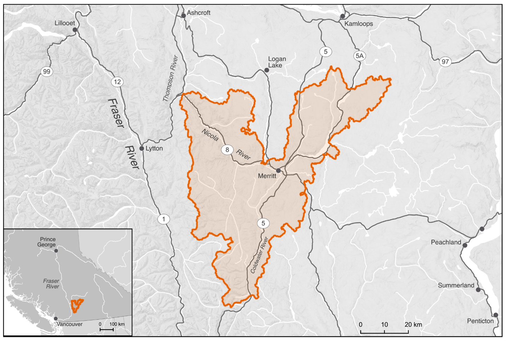

# Introduction {-}

## Purpose{-}

This 10-year plan was developed to identify priority actions that the Lower Nicola River WCRP Planning Team will undertake between 2021-2031 to conserve and restore fish passage in the watershed, through lateral and thermal barrier rehabilitation, crossing rehabilitation, and barrier prevention strategies.  

WCRPs are long-term, actionable plans that blend local stakeholder and rightsholder knowledge with innovative geographic information system (GIS) analyses to gain a shared understanding of where remediation efforts will have the greatest benefit for migratory fish. The planning process is inspired by the Conservation Standards (v.4.0), which is a conservation planning framework that allows Planning Teams to systematically identify, implement, and monitor strategies to apply the most effective solutions to high-priority conservation problems. There is a rich history of fish and fish habitat conservation and restoration work in the Lower Nicola watershed that this WCRP builds upon and aims to complement over the length of the plan. This includes work undertaken by the Scw’exmx Tribal Council and the five member or affiliate nations (see Scope), the Nicola Watershed Governance Project, the Nicola Basin Collaborative, and the Risk Assessment Methodology for Salmon (RAMS). The Canadian Wildlife Federation will continue to engage and coordinate with local partners and existing initiatives such as the Nicola Watershed Governance Project and the Nicola Basin Collaborative to promote coordination, decision-making, and implementation related to this plan.  

The Planning Team compiled existing location and assessment data for potential barriers, habitat data, and previously identified priorities in the watershed, and combined this with local and Indigenous knowledge to create a strategic watershed-scale plan to improve connectivity. To expand on this work, the Lower Nicola River WCRP Planning Team defined the thematic scope of freshwater connectivity and refined the geographic scope to those portions of the watershed where barrier prioritization would be conducted and subsequent rehabilitation efforts will take place.  

Local data and knowledge are combined with connectivity modelling to estimate current connectivity status and identify structures that potentially block the most habitat. This informs the prioritization of field assessments to close the most significant knowledge gaps efficiently. Information from field assessments of barrier status and habitat condition are incorporated into a GIS-based model, improving understanding of which barriers block the most habitat. 

This information is also used to inform and plan restoration efforts. Structure rankings inform restoration prioritization by summarizing what is known about fragmentation and showing the relative amount of habitat upstream of each barrier. Actual prioritization of restoration activities is a social decision that requires additional information, including the quality and condition of upstream habitat, the cultural importance of different areas within the watershed, and the costs and logistics of addressing each barrier relative to the ecological benefits of doing so.  

WCRPs are intended to be “living plans” that are updated regularly as new information becomes available or if local priorities and contexts change. As knowledge gaps are closed and barriers are addressed, this plan is revised to summarize progress and provide updated estimates of connectivity status and the status and relative importance of remaining structures. 


## Vision Statement  {-}

Healthy, well-connected streams and rivers within the Lower Nicola River watershed support thriving populations of migratory fish. In turn, these fish provide the continued sustenance, cultural, and ceremonial needs of the Nlaka’pamux/Scw'exmx and Syilx peoples, as they have since time immemorial. Both residents and visitors to the watershed work together to mitigate the negative effects of aquatic barriers, improving the resiliency of streams and rivers for the benefit and appreciation of all. 


## Scope  {-}

This WCRP focuses on habitat connectivity for Chinook Salmon (Onchorhunchus tschawystcha), Coho Salmon (O. kisutch) and steelhead (O. mykiss) (herein referred to as Pacific salmon and steelhead) in the Lower Nicola River watershed. These species are culturally and economically important populations that historically supported Indigenous sustenance and trading economies (Table x; Lower Nicola Indian Band 2015, ESSA 2019, Coldwater Band 2021). 

The Lower Nicola River watershed comprises parts of the traditional territory of the Nlaka’pamux/Scw'exmx and Syilx peoples, represented by the Scw’exmx Tribal Council, the four member nations (Coldwater Band, Nooaitch Band, Shackan Indian Band, and Upper Nicola Band), and the individual nations of the Lower Nicola Indian Band and the Cook's Ferry Band. The Nlaka’pamux/Scw'exmx and Syilx peoples steward the land and the waters of the Lower Nicola River watershed. The Lower Nicola River watershed has a drainage area of 376,064 ha and is located in the Thompson drainage basin of the Fraser River system in south-central British Columbia (Figure x).  

The geographic scope constitutes the Lower Nicola "1:20,000 watershed group" as defined by the British Columbia Freshwater Atlas (FWA), which excludes the Guichon Creek drainage and the Nicola River and Quilchena Creek drainages upstream of Nicola Lake. The Planning Team identified a few tributaries to the mainstem Nicola River as watershed exclusion areas due to intermittent or insufficient flows to support restoring connectivity for Pacific salmon and steelhead, including Hamilton Creek and agricultural irrigation ditches just downstream of Nicola Lake Dam. Additionally, Stumplake Creek and Peter Hope Creek were identified as watershed exclusion areas due to the presence of invasive Yellow Perch (Perca flavescens). It is unclear whether existing barriers located in these systems will be effective in preventing the downstream spread of Yellow Perch, but the Planning Team advised maintaining the barriers for the time being. 

The thematic scope of this WCRP is freshwater connectivity. Connectivity is a critical component of freshwater ecosystems that encompasses a variety of factors related to ecosystem structure and function, such as the ability of aquatic organisms to disperse and/or migrate, the transportation of energy and matter (e.g., nutrient cycling and sediment flows), and temperature regulation (Seliger & Zeiringer 2018). Though each of these factors are important when considering the health of a watershed, for the purposes of this WCRP the term "connectivity" is defined as the degree to which aquatic organisms can disperse and/or migrate freely through freshwater systems. Connectivity can be disrupted by physical barriers to connectivity in the longitudinal (i.e., upstream-downstream) and lateral (i.e., connectivity between the mainstem and adjacent wetlands, floodplains, side channels, and off-channel habitat) planes, including dams, weirs, stream crossings, dykes, linear infrastructure, waterfalls, and debris flows. Freshwater systems can also be disconnected by "physiological" barriers that prevent the free dispersal of species, including thermal (i.e., reaches where stream temperatures are too high) or flow (i.e., reaches where stream flow is insufficient to support the requirements of any life stage) barriers.  

Model outputs include an estimate of the current connectivity status along with structure ranks and counts. The model takes into consideration those portions of the Lower Nicola River watershed that are expected to support spawning or rearing habitat (or both) for Pacific salmon and steelhead and determines which man-made structures, including all types of dams and road-stream crossings, either individually or in sets, are fragmenting the most habitat in the watershed. The Nicola Lake dam is equipped with a fish ladder and is currently excluded from the model as a focal structure, though further investigation into the effectiveness of the fish ladder at passing fish is being considered.  

Diffuse natural barriers that make entire areas impassible are not included in the models but may be used to define the scope of this WCRP. For example, a naturally impassable waterfall that prevents access to high-quality habitat would be excluded from the model. A tributary that is inhospitable because of increased water temperature may also be excluded from the overall spatial scope of the WCRP because restoration needs there are broader than connectivity.

{fig-cap-location="top"}


## Focal Species {-}

Focal species represent the ecologically and culturally important species for which habitat connectivity is being conserved and/or restored in the watershed. In the Lower Nicola River watershed, the Planning Team selected Anadromous Salmonids as the focal species group, which comprises Chinook Salmon, Coho Salmon, and steelhead. The selection of these species was driven primarily by the primary funds supporting this planning work (British Columbia Salmon Restoration and Innovation Fund and Canada Nature Fund for Aquatic Species at Risk). The Planning Team also identified other culturally and ecologically important species within the watershed to consider for inclusion in future iterations of the WCRP, including kokanee (O. nerka), Bull Trout (Salvelinus confluentus), resident Rainbow Trout (O. mykiss), Whitefish (Coregonus clupeaformis), Burbot (Lota lota), and Pink Salmon (O. gorbuscha).  


### Anadromous Salmonids  {-}

Anadromous salmonids are cultural and ecological keystone species that contribute to productive ecosystems by contributing marine-derived nutrients to the watershed and forming an important food source for bears and other species (Schindler et al. 2003). Pacifc salmon and steelhead have enduring food, social, and ceremonial value for First Nations in Lower Nicola watershed – having sustained life, trading economies, and culture for the Nlaka’pamux/Scw’exmx and Syilx peoples since time immemorial (Lower Nicola Indian Band 2015, ESSA 2019, Coldwater Band 2021). The harvest and processing of these species have helped pass knowledge and ceremony to future generations (Fraser Basin Council n.d., Lower Nicola Indian Band 2015).  

Anadromous salmonid populations in the Lower Nicola River watershed have declined significantly since the mid-1980s, leading First Nations communities to voluntarily reduce their harvest (ESSA 2019). The Nlaka’pamux/Scw’exmx and Syilx peoples have always been stewards of the lands, resources, and fisheries in their traditional territories through an interconnected relationship based on respect and reverence, captured by the Syilx concept of Tmixw – the people only take the salmon that is needed (Lower Nicola Indian Band 2015, ESSA 2019, Upper Nicola Band 2021). The stewardship of their waters continues through the work of the Scw’exmx Tribal Council, the four member communities, the Lower Nicola Indian Band, and initiatives like the Nicola Watershed Governance Project. The Chinook Salmon (Endangered), Coho Salmon (Threatened), and steelhead (Endangered) populations have all been assessed and proposed for Species at Risk Act listing by the Committee on the Status of Endangered Wildlife in Canada (COSEWIC). The development and implementation of this WCRP aims to support and supplement on-going work by the Nlaka’pamux/Scw’exmx, Syilx, and other local groups by providing an action plan to address the specific, tractable conservation threat posed by fragmentation through the restoration and preservation of habitat connectivity for these important species.  


### Chinook Salmon | k’ʷy’íʔe/pəqéłus | Oncorhynchus tshawytscha {-}
Chinook Salmon are one of the first species to return to the watershed each year, arriving as early as May, and the population has been in decline since the mid-1990s (LGL Ltd. 2007, Ecoscape 2017). Known and historic spawning locations include the mainstem Nicola River (mostly between the Coldwater River and Spius Creek confluences), Coldwater River, Spius Creek, lower portions of Clapperton Creek, and upstream of Nicola Lake in Moore Creek and the Upper Nicola River (LGL Ltd. 2007, Ecoscape 2017, PSF 2025). In addition to these spawning systems, important juvenile rearing areas have been observed in Juliet Creek and Voght Creek (LGL Ltd. 2007). Chinook Salmon stocks have been supplemented by the Spius Creek hatchery since the 1980s. Fry and smolt releases have occurred and the Nicola stock is current enhanced by ~200,000 coded-wire tagged yearling smolts annually as a component of the Pacific Salmon Commission indicator stock study program (R. Bailey, pers. comm.). 

```{r tbl1, echo = FALSE, results = 'asis'}
#| label: tbl-1
#| tbl-cap: "Table 1. Chinook Salmon (Oncorhynchus tschawytscha) Designated Unit assessment in the Lower Nicola River watershed. Assessments undertaken by the Committee on the Status of Endangered Wildlife in Canada (2020a)."
#| warning: false
#| echo: false
source("Rscripts/table_formatting.R")
library("flextable")

data <- read.csv("data/table1.csv", check.names=FALSE)
ft <- flextable(data)
ft <- format_flextable(ft)
ft
```


### Coho Salmon | sx̣a̓yqs | Oncorhynchus kisutch   {-}
Coho Salmon begin to return to the watershed in September, with spawning beginning in late October and continuing through December. The population has been in decline since the mid-1980s (Fisheries and Oceans Canada 1991, Ecoscape 2017). Coho Salmon stocks have been supplemented in recent decades by outplants from the Spius Creek Hatchery (Ecoscape 2017). The majority of Coho Salmon spawning and rearing occurs in the Coldwater River, Spius Creek, and Maka Creek, but has also been observed in Clapperton Creek, Prospect Creek, and the Upper Nicola River and Moore Creek (LGL Ltd. 2007, PSF 2025). The lower reaches of many smaller tributaries are also important Coho Salmon rearing habitat. 
```{r tbl2, echo = FALSE, results = 'asis'}
#| label: tbl-2
#| tbl-cap: "Table 2. Coho Salmon (Oncorhynchus kisutch) Designated Unit assessment in the Lower Nicola River watershed. Assessments undertaken by the Committee on the Status of Endangered Wildlife in Canada (2016)."
#| warning: false
#| echo: false
source("Rscripts/table_formatting.R")
library("flextable")

data <- read.csv("data/table2.csv", check.names=FALSE)
ft <- flextable(data)
ft <- format_flextable(ft)
ft
```


### Steelhead | cóʕʷłeʔ | Oncorhynchus mykiss   {-}
Steelhead join Chinook Salmon as the first to appear in the watershed, arriving in the spring (LGL Ltd. 2007). The population is critically endangered and is seen as an extreme conservation concern (Bos 2006). Steelhead spawning and rearing is known to occur in the lower portion of the mainstem Nicola River, Skuhun Creek, Shakan Creek, Nuaitch Creek, Maka Creek, the Coldwater River, Juliet Creek, Voght Creek, Prospect Creek, and Clapperton Creek (LGL Ltd. 2007). Historically, almost all third-order and greater streams would have supported steelhead, and groundwater-fed thermal refugia continue to provide important rearing and holding habitats (Ecoscape 2017). 
```{r tbl3, echo = FALSE, results = 'asis'}
#| label: tbl-3
#| tbl-cap: "Table 3. Steelhead (Onchorhynchus mykiss) Designated Unit assessment in the Lower Nicola River watershed. Assessments undertaken by the Committee on the Status of Endangered Wildlife in Canada (2020b)."
#| warning: false
#| echo: false
source("Rscripts/table_formatting.R")
library("flextable")

data <- read.csv("data/table3.csv", check.names=FALSE)
ft <- flextable(data)
ft <- format_flextable(ft)
ft
```


## Barrier Types {-}

The following table highlights barrier types threatening anadromous salmonids in the watershed. The results of this assessment were used to inform the subsequent planning steps, as well as to identify knowledge gaps where there are limited spatial data to inform the assessment for a specific barrier type. 
```{r tbl4, echo = FALSE, results = 'asis'}
#| label: tbl4
#| tbl-cap: 'Table 4. Barrier types in the Lower Nicola River watershed and barrier rating assessment results. For each barrier type listed, "Extent" refers to the proportion of anadromous salmonid habitat that is being blocked by that barrier type, "Severity" is the proportion of structures for each barrier type that are known to block passage for focal species based on field assessments, and "Irreversibility" is the degree to which the effects of a barrier type can be reversed and connectivity restored. The amount of habitat blocked used in this exercise is a representation of total amount of combined thermal refuge, spawning, and rearing habitat.'
#| warning: false
#| echo: false
source("Rscripts/table_formatting.R")
library("flextable")

data <- read.csv("data/table4.csv", check.names=FALSE)
ft <- flextable(data)

rating_fill <- function(x) {
  ifelse(
    x == "Very High", "#ff0000",
    ifelse(
      x == "High", "#ffff00",
      ifelse(
        x == "Medium", "#92d050",
        ifelse(x == "Low", "#008000", NA_character_)
      )
    )
  )
}

ft <- bg(ft, j = c("Extent", "Severity", "Irreversibility", "Overall Threat Rating"),
         bg = rating_fill, part = "body")
ft <- format_flextable(ft)
ft
```


### Lateral Barriers (including to thermal connectivity)   {-}

There are numerous types of lateral barriers that potentially occur in the watershed, including dykes, berms, and linear development (i.e., road and abandoned rail lines), all of which can restrict the ability of anadromous salmonids to move into floodplains, riparian wetlands, off-channel habitats, and other groundwater-fed thermal refugia. No comprehensive lateral barrier dataset existed within the watershed at the time of Planning Team scoring, so pressure ratings were based on qualitative local knowledge. Lateral barriers were identified as the primary connectivity concern in the watershed due to a High extent for all target species' habitats and a Very high severity of barriers (i.e., almost all structures are blocking the movement of fish). Highway 5, Highway 8, and the two abandoned rail lines run along significant stretches of the Coldwater River and mainstem Nicola River and likely disconnect these mainstems from segments of their historic floodplains, off-channel habitats, and thermal refugia in certain locations. Other lateral barriers include irrigation infrastructure that occurs in the valley bottom on agricultural land. Overall, the Planning Team decided that a High pressure rating captured the effect that lateral barriers are likely having on connectivity in the watershed, particularly thermal connectivity, while recognizing that the lack of data on lateral barriers in the watershed was an important knowledge gap to fill. 


### Natural Barriers  {-}

Natural barriers to fish passage can include debris flows, log jams, sediment deposits, etc., but natural features that have always restricted fish passage (e.g., waterfalls) are not considered under this barrier type. Natural barriers are difficult to include in a spatial prioritization framework due to their transient nature. The Planning Team felt that the major drivers of natural barriers were massive sediment aggradation that has occurred in the watershed in recent years and changes in the natural flow regime of the watershed. The associated channel destabilization creates impassable stream segments due to a lack of flow and increased lateral migration of streams. The extent, severity, and passability of these obstacles will vary over time depending on the season and year; however, current and historic land-use practices, including forest harvesting, agriculture, and water withdrawals have exacerbated the effect of natural barriers in the watershed. Due to the nature of these land-use practices, the severity of natural barriers was rated as Very high and the irreversibility as Medium, the latter due to the effort required to rectify poor land-use practices at a watershed scale. Overall, the Planning Team felt that a pressure rating of ‘High’ adequately captured the effects of natural barriers.  


### Road-stream Crossings  {-}

Road-stream crossings are an abundant barrier type in the watershed. Significant land use and linear development throughout the valley bottom has disconnected the Nicola River from important habitat in some tributaries, including Highway 5 and Highway 8. The collective experience and input from the Planning Team resulted in a Low irreversibility rating due to the existing body of knowledge and resources to support the rehabilitation of road-stream crossings, though it was noted that there is significant variability between resource roads and highway crossings.  


### Small Dams (<3 m height) {-}

There only a small handful mapped dams on modelled anadromous salmonid habitat in the watershed, and the Planning Team verified a Low extent rating for these structures. Many dams in the watershed are irrigation impoundments that are of little consequence to anadromous species, despite most being unlikely to be equipped with fish passage structures. The Nicola Lake dam is equipped with a fish ladder and is excluded from consideration under this WCRP, though further investigation into fish ladder effectiveness is being considered. Rehabilitating dams requires significant resources; however, due to the minimal extent of dams in the watershed, a final pressure rating of Low was assigned to this barrier type.


### Abandoned Rail-Stream Crossings (Longitudinal)  {-}

There are no active rail lines in the Lower Nicola watershed; however, infrastructure remains in place from the historic Nicola Valley Railway and the Kettle Valley Railway in the form of abandoned railbeds and associated stream crossings. There are no data to support the assessment of the severity of these crossings, but the collective knowledge of the Planning Team resulted in a Low severity rating because most are believed to be serviced by bridges or open-bottom structures. Despite the moderate technical knowledge and resources required to rehabilitate these barriers, the low extent and low severity resulted in the overall pressure rating of Low. The abandoned rail lines, however, were identified by the Planning Team as a contributor to lateral and thermal disconnectivity in the watershed (see Lateral Barriers (including to thermal connectivity)).  


### Trail-stream Crossings {-}

There are very little spatial data available on trail-stream crossings in the watershed, so the Planning Team was unable to quantify the true Extent and Severity of this barrier type. However, the Planning Team felt that trail-stream crossings are not prevalent within the watershed and that where they do exist, they do not significantly restrict passage for anadromous salmonids. Because most crossings will likely be fords or similar structures, the rehabilitation costs associated with these barriers would be quite low. Overall, the Planning Team felt that the pressure rating for trail-stream crossings was likely Low. 


### Lower Nicola River Temperature and Flow Sensitivities  {-}

The broader Nicola basin has been designated as a temperature- and flow-sensitive watershed in British Columbia, and both factors significantly affect connectivity for fish species in the Lower Nicola (ESSA 2019, MFLNRORD 2018). The changing thermal regime of the Lower Nicola River watershed is a growing concern, with two scales of thermal disconnectivity occurring within the watershed — watershed-scale changes in thermal regimes and localized barriers preventing access to thermal refugia.  

The watershed-scale changes to the thermal regime are linked to several landscape-scale drivers including increases in water withdrawals, changes in land use, deforestation (due to resource extraction and mountain pine beetle infestations), and climate change, which are exacerbated by subsequent changes to channel-forming processes (ESSA 2019). These changes have created annual thermal barriers that prevent access to headwater reaches from the mainstem channels along the valley floor. This has resulted in the adaptation of an early-migrant Chinook Salmon population, which uses the upper portions of Spius Creek and tributaries and the upper reaches of the Coldwater River, where access to the spawning grounds requires passing through the lower sections before the stream temperatures create physiological thermal barriers. These returning adults pass through the lower reaches in May and June as the freshet starts to abate, then hold in deeper pools for two months until they spawn in mid-to-late August (R. Bailey, Nooaitch Band, pers. comm.).  

Localized thermal disconnectivity in the lateral dimension occurs when rearing and out-migrating juveniles are unable to access side-channel and off-channel thermal refugia and holding pools due to changing channel processes exacerbated by upland management and the development of linear infrastructure including dykes, roads, railways, and trails. These groundwater-serviced reaches located in side channels or off-channel habitats provide thermal refuge for juvenile fish in the watershed and can also provide critical refuge for returning spawners. When these lateral refugia become disconnected from mainstem channels, lethal stream temperatures can cause juvenile die-offs. Activities that restore and protect connectivity to these lateral refugia, particularly those cooled by groundwater sources, can help mitigate thermal disconnectivity in the watershed.  

Mitigation of the landscape-scale drivers of changes to the thermal regimes are outside of the scope of this plan. While vital for the long-term resilience of the watershed, the broad land-use patterns, over-subscription of water withdrawals, and climate change that are causing chronic thermal issues in the watershed require more complex, coordinated, and resource-intensive solutions than this planning process can provide. This plan is intended to focus on the direct rehabilitation and prevention of localized, physical barriers to lateral thermal refugia and longitudinal connectivity to maintain fish passage to spawning, rearing, and refuge habitat. Lateral, and associated thermal, connectivity was identified by the Planning Team as the primary connectivity concern in the watershed within the defined scope of this plan.
