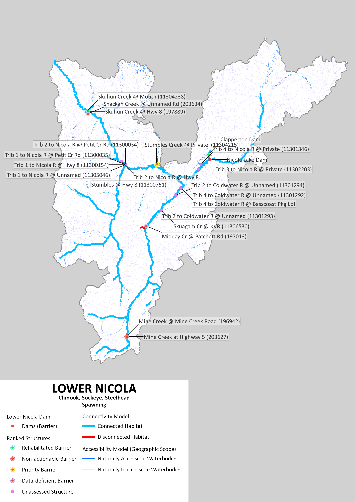
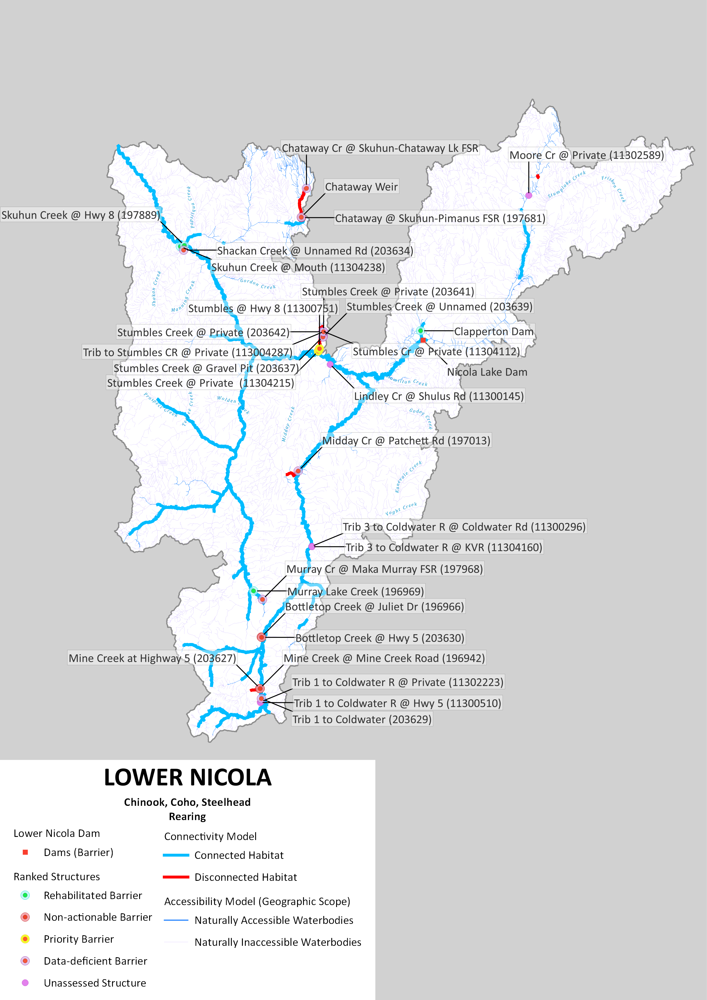

---
jupyter: python3
---

## Executive Summary {-}

```{python}
#| echo: false
#| output: false
from content.python.api_calls_v2 import (
    count_assessment_type,
    count_completed_assessments,
    count_structure_list_status,
    get_metric_value,
    get_structure_count_value,
    sum_structure_list_status_metric,
)

spawning_connected_km = get_metric_value("LNIC", "accessible_spawning_all")
spawning_disconnected_km = get_metric_value("LNIC", "disconnected_spawning_all")
spawning_total_km = get_metric_value("LNIC", "total_spawning_all")
spawning_connected_pct = round((spawning_connected_km / spawning_total_km) * 100, 1)

rearing_connected_km = get_metric_value("LNIC", "accessible_rearing_all")
rearing_disconnected_km = get_metric_value("LNIC", "disconnected_rearing_all")
rearing_total_km = get_metric_value("LNIC", "total_rearing_all")
rearing_connected_pct = round((rearing_connected_km / rearing_total_km) * 100, 1)

potentially_disconnect_spawning_structures = get_structure_count_value(
    "lnic", "all_spawning", "structures_that_potentially_disconnect_habitat"
)
potentially_disconnect_rearing_structures = get_structure_count_value(
    "lnic", "all_rearing", "structures_that_potentially_disconnect_habitat"
)
priority_barriers = get_structure_count_value(
    "lnic", "all_spawningrearing", "priority_barriers"
)
non_actionable_spawning = get_structure_count_value(
    "lnic", "all_spawning", "non_actionable_barriers"
)
non_actionable_rearing = get_structure_count_value(
    "lnic", "all_rearing", "non_actionable_barriers"
)
further_field_assessment_spawning = get_structure_count_value(
    "lnic", "all_spawning", "require_further_assessment"
)
further_field_assessment_rearing = get_structure_count_value(
    "lnic", "all_rearing", "require_further_assessment"
)
further_field_assessment = get_structure_count_value(
    "lnic", "all_spawningrearing", "require_further_assessment"
)

assessed_structures = count_completed_assessments()
habitat_confirmations = count_assessment_type("Habitat confirmation")
rehabilitated_barriers = count_structure_list_status("Rehabilitated barrier")
rehabilitated_habitat_km = sum_structure_list_status_metric(
    "Rehabilitated barrier",
    "all_spawningrearing_belowupstrbarriers_km"
)
```
The purpose of the Lower Nicola River Watershed Connectivity Restoration Plan (WCRP) is to improve understanding of habitat connectivity for Chinook Salmon (*Onchorhunchus tschawystcha*), Coho Salmon (*O. kisutch*) and steelhead (*O. mykiss*) (herein referred to as Pacific salmon and steelhead) in the Lower Nicola River watershed and inform efforts to close knowledge gaps and plan and prioritize restoration. The lands and waters that form the basis of this plan are the traditional unceded territory of the Nlaka’pamux/Scw'exmx and Syilx peoples. 

Local data and knowledge are combined with connectivity modelling to estimate current connectivity status and identify structures that potentially block the most habitat. This informs the prioritization of field assessments to close the most significant knowledge gaps efficiently. Information from field assessments of barrier status and habitat condition are incorporated into the model, improving understanding of which barriers block the most habitat, and informing restoration prioritization. As knowledge gaps are closed and barriers are addressed, this plan will be revised to summarize progress and provide updated estimates of connectivity status and the status and relative importance of remaining structures. 

In the Lower Nicola River watershed, `{python} spawning_connected_km` km of spawning habitat are currently connected to the ocean and `{python} spawning_disconnected_km` km are disconnected from it. This means that `{python} spawning_connected_pct`% of the `{python} spawning_total_km` km of total habitat is connected. `{python} rearing_connected_km` km of rearing habitat are currently connected to the ocean and `{python} rearing_disconnected_km` km are disconnected from it. This means that `{python} rearing_connected_pct`% of the `{python} rearing_total_km` km of total habitat is connected. 

In the Lower Nicola River watershed, `{python} potentially_disconnect_spawning_structures` structures potentially disconnect spawning habitat. Of these, `{python} priority_barriers` are identified as barriers in need of rehabilitation (priority barriers), `{python} non_actionable_spawning` are identified as barriers that do not warrant rehabilitation (non-actionable), and `{python} further_field_assessment_spawning` require further field assessment. `{python} potentially_disconnect_rearing_structures` structures potentially disconnect rearing habitat. Of these, `{python} priority_barriers` are identified as barriers in need of rehabilitation (priority barriers), `{python} non_actionable_rearing` are identified as barriers that do not warrant rehabilitation (non-actionable), and `{python} further_field_assessment_rearing` require further field assessment. 

::: {#fig-map1}


 Figure 1: Map of spawning habitat and structures that are confirmed or potential barriers to fish passage in the Lower Nicola River watershed as of May 2026. Structure data were obtained from BCFishPass and the Canadian Aquatic Barriers Database (aquaticbarriers.ca). The accessibility model represents areas of the watershed that one or more species of Pacific salmon and steelhead could access naturally in the absence of anthropogenic barriers. The habitat model represents the subset of accessible waterbodies that may be used by one or more species of Pacific salmon and steelhead for spawning or rearing. Available local knowledge and data were incorporated and overruled habitat model results. Thick red lines represent habitat considered to be fully disconnected (upstream of barriers or unassessed structures). Barriers that were rehabilitated through implementation of this plan are shown, but other excluded structures (e.g., those found to be passable) are not. 
:::

::: {#fig-map2}


 Figure 2: Map of rearing habitat and structures that are confirmed or potential barriers to fish passage in the Lower Nicola River watershed as of May 2026. Structure data were obtained from BCFishPass and the Canadian Aquatic Barriers Database (aquaticbarriers.ca). The accessibility model represents areas of the watershed that one or more species of Pacific salmon and steelhead could access naturally in the absence of anthropogenic barriers. The habitat model represents the subset of accessible waterbodies that may be used by one or more species of Pacific salmon and steelhead for spawning or rearing. Available local knowledge and data were incorporated and overruled habitat model results. Thick red lines represent habitat considered to be fully disconnected (upstream of barriers or unassessed structures). Barriers that were rehabilitated through implementation of this plan are shown, but other excluded structures (e.g., those found to be passable) are not. 
:::

::: {#fig-hac}


 Figure 3: Habitat Accumulation Curve (HAC) showing structures in the Lower Nicola River watershed as of May 2026. Structures are ranked based on how much (km) of habitat for Pacific salmon and steelhead is upstream. The y-axis represents the cumulative amount of potential habitat gain (km). Sets of structures are indicated by a grey line below the curve, indicating that gains from addressing the downstream structure alone would be less than the combined gains from addressing all structures in the set. Habitat upstream of unassessed structures is considered disconnected until field assessments are completed. Structures that were excluded as passable are not shown; however, rehabilitated barriers are shown to demonstrate the connectivity gains achieved through implementation of this plan.  
:::

This WCRP was initiated in 2020 with a series of workshops completed with local partners and rightsholders, and the first version of this WCRP was published in 2021. Since inception, the passability of `{python} assessed_structures` structures has been assessed, and further habitat assessments were completed at `{python} habitat_confirmations` of these. Fish passage has been rehabilitated at `{python} rehabilitated_barriers` barriers: Skuhun Creek mouth and Highway 8 crossings, Clapperton Creek dam, and Murray Lake Creek at Maka-Murray/Maka-Michael FSR junction. This has resulted in improved or restored access to `{python} rehabilitated_habitat_km` km of habitat. Some lateral habitat and thermal refugia investigations were also completed as part of this WCRP process; however, other groups active in the Lower Nicola have both pioneered and advanced this work beyond what was completed and reported upon here.  
